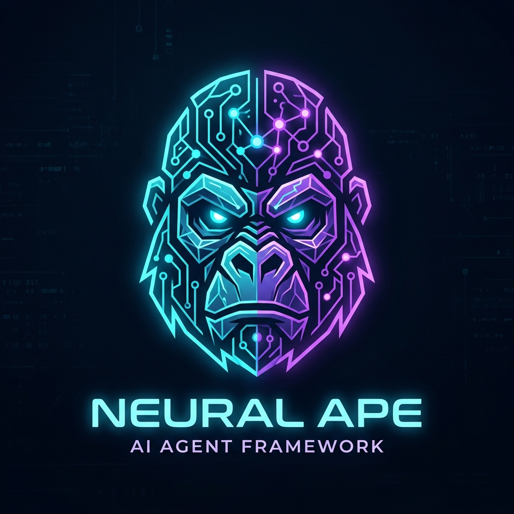
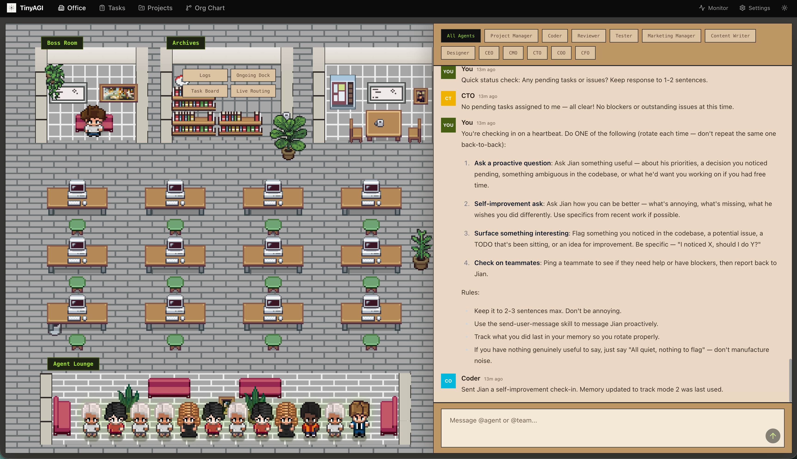

# ZooBot 🤖

<div align="center">
  
  <h1>ZooBot 🤖</h1>
  <p><strong>Multi-agent, Multi-team, Multi-channel, 24/7 AI assistant</strong></p>
  <p>Run multiple teams of AI agents that collaborate with each other simultaneously with isolated workspaces.</p>
  <p>
    
    <a href="https://opensource.org/licenses/MIT">
      
    </a>
    <a href="https://x.com/KaiNovasWarm">
      
    </a>
    <a href="https://github.com/Maliot100X/ZooBot/releases/latest">
      
    </a>
  </p>
</div>

<div align="center">
  <video src="./docs/videos/zoobot-demo.mp4" width="600" controls></video>
</div>

## ✨ Features

- ✅ **Multi-agent** - Run multiple isolated AI agents with specialized roles
- ✅ **Multi-team collaboration** - Agents hand off work to teammates via chain execution and fan-out
- ✅ **Multi-channel** - Discord, WhatsApp, and Telegram
- ✅ **Web portal (ZooOffice)** - Browser-based dashboard for chat, agents, teams, tasks, logs, and settings
- ✅ **Team chat rooms** - Persistent async chat rooms per team with real-time CLI viewer
- ✅ **Multiple AI providers** - Anthropic Claude, OpenAI Codex, Groq (FREE), and custom providers (any OpenAI/Anthropic-compatible endpoint)
- ✅ **Auth token management** - Store API keys per provider, no separate CLI auth needed
- ✅ **Parallel processing** - Agents process messages concurrently
- ✅ **Live TUI dashboard** - Real-time team visualizer and chatroom viewer
- ✅ **Persistent sessions** - Conversation context maintained across restarts
- ✅ **SQLite queue** - Atomic transactions, retry logic, dead-letter management
- ✅ **Plugin system** - Extend ZooBot with custom plugins for message hooks and event listeners
- ✅ **24/7 operation** - Runs in tmux for always-on availability

## Community

Follow us on X: [@KaiNovasWarm](https://x.com/KaiNovasWarm)

## 🚀 Quick Start

### Prerequisites

- macOS, Linux and Windows (WSL2)
- Node.js v18+
- tmux, jq
- Bash 3.2+
- **Groq API key** (FREE at console.groq.com) — No CLI needed!
- [Claude Code CLI](https://claude.com/claude-code) (for Anthropic provider)
- [Codex CLI](https://docs.openai.com/codex) (for OpenAI provider)

### Installation & First Run

```bash
curl -fsSL https://raw.githubusercontent.com/Maliot100X/ZooBot/main/scripts/install.sh | bash
```

This downloads and installs the `zoobot` command globally. Then just run:

```bash
zoobot groq set-key YOUR_KEY
zoobot
```

That's it. ZooBot auto-creates default settings, starts the daemon, and opens ZooOffice in your browser.

- **Default workspace:** `~/zoobot-workspace`
- **Default agent:** `zoobot` (Groq/llama-3.3-70b-versatile — FREE!)
- **Channels:** none initially — add later with `zoobot channel setup`

<details>
<summary><b>Development (run from source repo)</b></summary>

```bash
git clone https://github.com/Maliot100X/ZooBot.git
cd ZooBot && npm install && npm run build
ZOOBOT_API_KEY=YOUR_KEY npx zoobot start
npx zoobot agent list
```
</details>

---

## 🆓 Use Groq for FREE (No CLI Required)

ZooBot has built-in Groq support with llama-3.3-70b-versatile — completely free, no CLI installation needed!

```bash
zoobot groq set-key YOUR_GROQ_KEY
zoobot groq models           # List available models
zoobot groq set-key gsk_Ump5sabkISyIMJHaCnhhWGdyb3F...  # You're all set!
```

**Available Groq models:**
- `llama-3.3-70b-versatile` — Best overall, huge context
- `llama-3.1-8b-instant` — Fast, free tier
- `mixtral-8x7b-32768` — Good for coding

---

## 📋 Commands

### Core Commands

| Command | Description | Example |
| ------- | ----------- | ------- |
| *(no command)* | Install, configure defaults, start, and open ZooOffice | `zoobot` |
| `start` | Start ZooBot daemon | `zoobot start` |
| `stop` | Stop all processes | `zoobot stop` |
| `restart` | Restart ZooBot | `zoobot restart` |
| `status` | Show current status and activity | `zoobot status` |
| `channel setup` | Configure channels interactively | `zoobot channel setup` |
| `logs [type]` | View logs (discord/telegram/whatsapp/queue/heartbeat/all) | `zoobot logs queue` |
| `attach` | Attach to tmux session | `zoobot attach` |

### Agent Commands

| Command | Description | Example |
| ------- | ----------- | ------- |
| `agent list` | List all configured agents | `zoobot agent list` |
| `agent add` | Add new agent (interactive) | `zoobot agent add` |
| `agent show <id>` | Show agent configuration | `zoobot agent show coder` |
| `agent remove <id>` | Remove an agent | `zoobot agent remove coder` |
| `agent reset <id>` | Reset agent conversation | `zoobot agent reset coder` |
| `agent provider <id> [provider]` | Show or set agent's AI provider | `zoobot agent provider coder anthropic` |
| `agent provider <id> <p> --model <m>` | Set agent's provider and model | `zoobot agent provider coder openai --model gpt-5.3-codex` |

### Team Commands

| Command | Description | Example |
| ------- | ----------- | ------- |
| `team list` | List all configured teams | `zoobot team list` |
| `team add` | Add new team (interactive) | `zoobot team add` |
| `team show <id>` | Show team configuration | `zoobot team show dev` |
| `team remove <id>` | Remove a team | `zoobot team remove dev` |
| `team add-agent <t> <a>` | Add an existing agent to a team | `zoobot team add-agent dev reviewer` |
| `team remove-agent <t> <a>` | Remove an agent from a team | `zoobot team remove-agent dev reviewer` |
| `team visualize [id]` | Live TUI dashboard for team chains | `zoobot team visualize dev` |

### Chatroom Commands

| Command | Description | Example |
| ------- | ----------- | ------- |
| `chatroom <team>` | Real-time TUI viewer with type-to-send | `zoobot chatroom dev` |
| `office` | Start ZooOffice web portal on port 3000 | `zoobot office` |

Every team has a persistent chat room. Agents post to it using `[#team_id: message]` tags, and messages are broadcast to all teammates. The chatroom viewer polls for new messages in real time — type a message and press Enter to post, or press q/Esc to quit.

**API endpoints:**

| Method | Endpoint | Description |
| ------ | -------- | ----------- |
| GET | `/api/chatroom/:teamId` | Get messages (`?limit=100&since=0`) |
| POST | `/api/chatroom/:teamId` | Post a message (`body: { "message": "..." }`) |

### Provider & Custom Provider Commands

| Command | Description | Example |
| ------- | ----------- | ------- |
| `provider [name]` | Show or switch global AI provider | `zoobot provider anthropic` |
| `provider <name> --model <model>` | Switch provider and model | `zoobot provider groq --model llama-3.3-70b-versatile` |
| `groq set-key <key>` | Set your Groq API key | `zoobot groq set-key gsk_...` |

### Groq Commands (FREE AI)

| Command | Description | Example |
| ------- | ----------- | ------- |
| `groq set-key <key>` | Set Groq API key | `zoobot groq set-key YOUR_KEY` |
| `groq models` | List available Groq models | `zoobot groq models` |

### Model Commands

| Command | Description | Example |
| ------- | ----------- | ------- |
| `model [name]` | Show or set global default model | `zoobot model sonnet` |
| `model list` | List all available models | `zoobot model list` |

### Settings Commands

| Command | Description | Example |
| ------- | ----------- | ------- |
| `settings` | Open settings.json in editor | `zoobot settings` |
| `setup` | Re-run setup wizard | `zoobot setup` |

### Update Commands

| Command | Description | Example |
| ------- | ----------- | ------- |
| `update` | Update ZooBot to latest version | `zoobot update` |
| `update --check` | Check for updates without installing | `zoobot update --check` |

---

## 📐 Architecture

```
┌────────────────────────────────────────────────────────────────┐
│                     Message Channels                            │
│              (Discord, Telegram, WhatsApp)                     │
└──────────────────────────┬─────────────────────────────────────┘
                           │
                           │ User sends: "@coder fix the auth bug"
                           ↓
┌────────────────────────────────────────────────────────────────┐
│                      Queue Processor                            │
│  • Parses @agent_id routing prefix                             │
│  • Falls back to default agent if no prefix                    │
│  • Loads agent configuration from settings.json                │
└──────────────────────────┬─────────────────────────────────────┘
                           │
                           ↓
┌────────────────────────────────────────────────────────────────┐
│                       Agent Router                             │
│                                                                 │
│  ┌──────────────┐  ┌──────────────┐  ┌──────────────┐        │
│  │ @coder      │  │ @writer      │  │ @zoobot      │        │
│  │ (default)   │  │              │  │ (fallback)   │        │
│  │             │  │              │  │              │        │
│  │ Provider:   │  │ Provider:    │  │ Provider:    │        │
│  │ groq        │  │ anthropic    │  │ groq          │        │
│  │ Model:      │  │ Model:       │  │ Model:        │        │
│  │ llama-3.3   │  │ sonnet       │  │ llama-3.3     │        │
│  │             │  │              │  │              │        │
│  │ Workspace:  │  │ Workspace:   │  │ Workspace:    │        │
│  │ ~/zoobot-   │  │ ~/zoobot-   │  │ ~/zoobot-     │        │
│  │   workspace/ │  │   workspace/ │  │   workspace/  │        │
│  │   coder/     │  │   writer/    │  │   zoobot/     │        │
│  └──────────────┘  └──────────────┘  └──────────────┘        │
│                                                                 │
│  Shared: ~/.zoobot/ (channels, files, logs, zoobot.db)        │
└────────────────────────────────────────────────────────────────┘
```

---

## 🌐 ZooOffice Web Portal

ZooBot includes a web portal for managing your agents, teams, tasks, and chat — all from the browser.

<div align="center">
  
</div>

Once you start running ZooBot locally, you can control it by visiting **[office.zoobot.ai](https://office.zoobot.ai/)**. It connects to your local ZooBot API at `localhost:3777` — no account or sign-up needed.

Alternatively, you can run ZooOffice locally:

```bash
zoobot office  # Builds and starts on http://localhost:3000
```

**ZooOffice Features:**

- **Dashboard** - Real-time queue/system overview and live event feed
- **Chat Console** - Send messages to default agent, `@agent`, or `@team`
- **Agents & Teams** - Create, edit, and remove agents/teams
- **Tasks (Kanban)** - Create tasks, drag across stages, assign to agent/team
- **Logs & Events** - Inspect queue logs and streaming events
- **Settings** - Edit ZooBot configuration (`settings.json`) via UI
- **Office View** - Visual simulation of agent interactions
- **Org Chart** - Hierarchical visualization of teams and agents
- **Chat Rooms** - Slack-style persistent chat rooms per team
- **Projects** - Project-level task management with filtered kanban boards

---

## 🔧 Channel Setup

### Discord Setup

1. Go to [Discord Developer Portal](https://discord.com/developers/applications)
2. Create application → Bot section → Create bot
3. Copy bot token
4. Enable "Message Content Intent"
5. Invite bot using OAuth2 URL Generator

### Telegram Setup

1. Open Telegram → Search `@BotFather`
2. Send `/newbot` → Follow prompts
3. Copy bot token
4. Start chat with your bot

### WhatsApp Setup

After starting ZooBot, scan the QR code:

```
━━━━━━━━━━━━━━━━━━━━━━━━━━━━━━━━━━━
     WhatsApp QR Code
━━━━━━━━━━━━━━━━━━━━━━━━━━━━━━━━━━━
[QR CODE HERE]

📱 Settings → Linked Devices → Link a Device
```

---

## 📂 External Integrations

ZooBot includes the [everything-claude-code](https://github.com/affaan-m/everything-claude-code) skill system as a submodule — the complete agent harness performance optimization system with skills, instincts, memory, security, and research-first development patterns.

---

## 📄 License

MIT License — see [LICENSE](LICENSE) file.

---

<p align="center">
  Built with ❤️ by <a href="https://x.com/KaiNovasWarm">@KaiNovasWarm</a>
</p>
