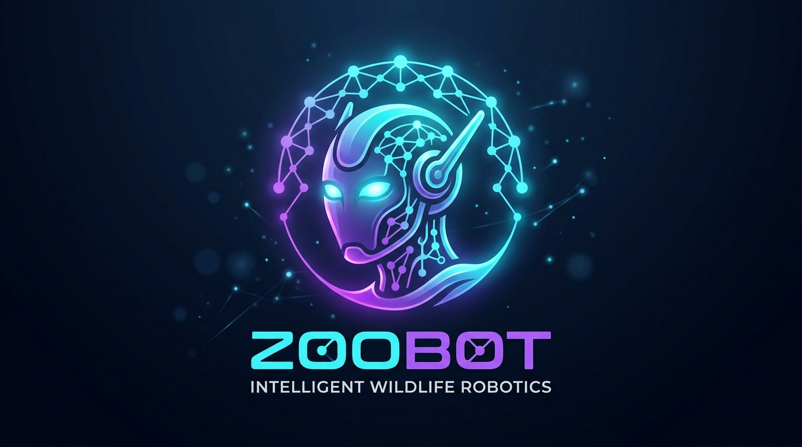

# ZooBot 🤖

<div align="center">
  
  <h1>ZooBot 🤖</h1>
  <p><strong>Multi-team AI agents — free, fast, and yours to own.</strong></p>
  <p>Run teams of AI agents that collaborate together. Powered by Groq's free inference. No credit card needed.</p>
  <p>
    <a href="https://github.com/Maliot100X/ZooBot">
      
    </a>
    <a href="https://opensource.org/licenses/MIT">
      
    </a>
    <a href="https://x.com/KaiNovasWarm">
      
    </a>
  </p>
</div>

---

## ✨ What ZooBot Does

- **Agents** — Multiple AI agents, each with their own workspace and conversation memory
- **Teams** — Agents hand off tasks to each other like a real team
- **Free AI** — Runs on Groq's free tier. No Anthropic subscription needed. No OpenAI credits needed.
- **Channels** — Connect Discord, Telegram, WhatsApp, or chat via web/API
- **Queue** — SQLite-backed message queue with retry logic and dead-letter handling
- **Plugins** — Extend ZooBot with custom hooks and event listeners
- **Always-on** — Runs 24/7 in tmux. Survives restarts.

---

## 🚀 Get Started

### One-line install

```bash
curl -fsSL https://raw.githubusercontent.com/Maliot100X/ZooBot/main/scripts/install.sh | bash
```

Then just run:

```bash
zoobot
```

That's it. ZooBot auto-creates config, starts the daemon, and opens ZooOffice in your browser.

### Requirements

- macOS, Linux, Windows (WSL2)
- Node.js v18+
- tmux, jq
- Bash 3.2+
- Groq API key (free at [console.groq.com](https://console.groq.com))

### Set your Groq key

```bash
export GROQ_API_KEY=gsk_your_key_here
```

Or add it to your `~/.zoobot/settings.json`:

```json
{
  "models": {
    "provider": "groq",
    "groq": {
      "model": "llama-3.3-70b-versatile",
      "auth_token": "gsk_your_key_here"
    }
  }
}
```

### Free Groq models

| Model | Context | Best for |
|-------|---------|----------|
| `llama-3.3-70b-versatile` | 128k | General purpose, coding, reasoning |
| `llama-3.1-8b-instant` | 128k | Fast lightweight responses |
| `mixtral-8x7b-32768` | 32k | Code and technical tasks |
| `llama-3.2-11b-vision-preview` | 128k | Image understanding |
| `allam-2-7b` | 128k | Scientific and research |

---

## 📁 Project Structure

```
zoobot/
├── packages/
│   ├── core/          # Queue, agents, teams, adapters (Groq, Claude, Codex)
│   ├── cli/           # CLI commands: agent, team, channel, model
│   ├── channels/      # Discord, Telegram, WhatsApp connectors
│   ├── mai/           # Messaging integration
│   └── visualizer/    # Live TUI dashboard
├── zoobot-office/     # Web portal (React + Tailwind)
│   └── src/
│       ├── pages/     # Dashboard, chat, kanban, logs, settings
│       └── components/# Recharts, Kanban board, agent cards
├── scripts/           # install.sh, update.sh, daemon, heartbeat
├── lib/               # Shell helpers
├── bin/               # zoobot CLI wrapper
├── docs/              # AGENTS.md, TEAMS.md, QUEUE.md, TROUBLESHOOTING.md
└── external/
    └── everything-claude-code/  # Skills & instincts system
```

---

## 🏗️ Architecture

```
┌─────────────────────────────────────────────────────────────┐
│                     Message Channels                         │
│         (Discord, Telegram, WhatsApp, Web, API)             │
└────────────────────┬────────────────────────────────────────┘
                     │ enqueueMessage()
                     ↓
┌─────────────────────────────────────────────────────────────┐
│               ~/.zoobot/zoobot.db (SQLite)                │
│                                                              │
│  messages: pending → processing → completed / dead          │
│  responses: pending → acked                                  │
│                                                              │
└────────────────────┬────────────────────────────────────────┘
                     │ Queue Processor
                     ↓
┌─────────────────────────────────────────────────────────────┐
│              Parallel Processing by Agent                    │
│                                                              │
│  Agent: coder        Agent: writer       Agent: assistant   │
│  ┌──────────┐       ┌──────────┐        ┌──────────┐       │
│  │ Message 1│       │ Message 1│        │ Message 1│       │
│  │ Message 2│  ...  │ Message 2│  ...   │ Message 2│  ...  │
│  │ Message 3│       │          │        │          │       │
│  └────┬─────┘       └────┬─────┘        └────┬─────┘       │
│       │                  │                     │             │
└───────┼──────────────────┼─────────────────────┼────────────┘
        ↓                  ↓                     ↓
   Groq API / CLI     Groq API / CLI        Groq API / CLI
  (workspace/coder)  (workspace/writer)   (workspace/assistant)
```

**Key features:**

- **SQLite queue** — Atomic transactions via WAL mode, no race conditions
- **Parallel agents** — Different agents process messages concurrently
- **Sequential per agent** — Preserves conversation order within each agent
- **Retry & dead-letter** — Failed messages retry up to 5 times, then enter dead-letter queue
- **Isolated workspaces** — Each agent has its own directory and context

---

## 📋 Commands

```bash
zoobot              # Install, configure, start, open ZooOffice
zoobot start       # Start daemon
zoobot stop        # Stop all processes
zoobot status      # Check what's running
zoobot logs all    # Tail all logs
zoobot logs agent  # Agent logs only

zoobot agent list          # List all agents
zoobot agent add           # Create new agent
zoobot agent remove <id>   # Remove agent
zoobot agent reset <id>    # Reset conversation

zoobot team list           # List all teams
zoobot team add            # Create new team
zoobot team show <id>      # Show team config

zoobot model <name>        # Set default model
zoobot provider <name>     # Switch provider

zoobot channel setup telegram   # Setup Telegram
zoobot channel setup discord    # Setup Discord
zoobot channel setup whatsapp   # Setup WhatsApp

zoobot groq set-key <key>  # Set Groq API key
```

---

## 🌐 ZooOffice Web Portal

ZooBot includes a full-featured web dashboard:

<div align="center">
  
</div>

Features:
- **Dashboard** — Real-time queue overview and event feed
- **Chat** — Send messages to any agent or team
- **Agents & Teams** — Create, edit, remove
- **Kanban Board** — Drag tasks across stages, assign to agents
- **Logs** — Full streaming event log
- **Settings** — Edit config via UI

### Running ZooOffice

```bash
zoobot office   # Starts on http://localhost:3000
```

Or visit **[office.zoobotcompany.com](https://office.zoobotcompany.com)** — it connects to your local ZooBot at `localhost:3777`.

---

## 🐛 Troubleshooting

```bash
# Reset everything (preserves settings)
zoobot stop && rm -rf ~/.zoobot/queue/* && zoobot start

# Reset WhatsApp
zoobot channels reset whatsapp

# Check status
zoobot status

# View logs
zoobot logs all
```

Common issues:

| Problem | Fix |
|---------|-----|
| WhatsApp not connecting | `zoobot channels reset whatsapp` |
| Messages stuck | `rm -rf ~/.zoobot/queue/processing/*` |
| Agent not found | `zoobot agent list` |
| Groq not working | Set key: `export GROQ_API_KEY=your_key` |
| Corrupted settings.json | ZooBot auto-repairs on next start |

---

## 🙏 Credits

Built by **@KaiNovasWarm** on X/Twitter — [https://x.com/KaiNovasWarm](https://x.com/KaiNovasWarm)

Powered by **Groq** for free, fast AI inference — [console.groq.com](https://console.groq.com)

Built on Claude Code and Codex CLI.

Uses discord.js, whatsapp-web.js, node-telegram-bot-api.

---

## 📄 License

MIT — free to use, modify, and distribute.
